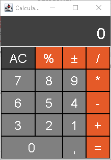
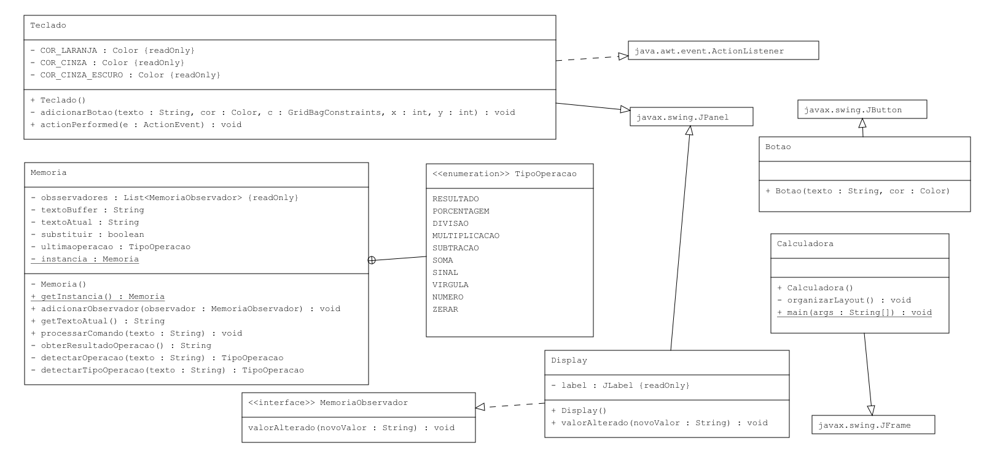

<!-- PROJECT SHIELDS | -->

    

  

Projeto com o objeto de apriomorar o conhecimento teórico e pratico em Java usando princípios de **Orientação a Objetos** e de **Programação Funcional**

<h1 align="center">Calculadora em Java</h1>

Aplicativo de calculadora em modo gráfico com Java e Swing.

**Versão:** v1.0

## Demonstração

  

## Progresso
- [x] Implementação das classes principais
- [x] Implementação da Interface Gráfica
- [X] Implementação dos cálculos
- [X] Criação de diagramas de classe

## Diagrama do código (UML Diagram)

  

-----------
## Licença de utilização

 
This work is licensed under a <a rel="license" href="http://creativecommons.org/licenses/by/4.0/">Creative Commons Attribution 4.0 International License</a>.

<!-- CONTACT -->
## Contato

  

  

  

**Author:** Jonas Araujo de Avila Campos

**Confira mais projetos: [AQUI](https://jonasaacampos.github.io/portifolio/)**

